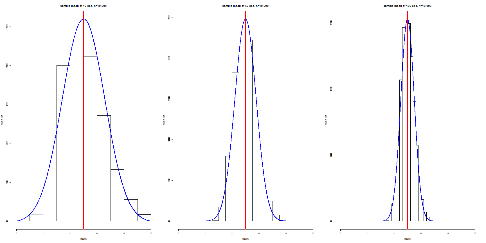

        Central Limit Theorem      - highlighted by Shiny
========================================================


author: SNB

date: 08.12.2015


Shiny Application
========================================================

Shiny is an excellent way of illustrating the asymptotic 
features of functions controlled by multiple parameters.

Taking the CTL theorem as presented in the Statistical Inference Module,
we have the three parameters:

- the particular distribution, eg. exponential, binomial, poisson
- population size
- sample size 

It can not only interactively plot graphs for a single parameter  
(see the R-package "manipulate"), but also adjust several variables.
For example, for the exponential distribution, a set of plots can illustrate 
how the simulation approaches a normal distribution as follows:

Constant distribution and population size
==================================================================

<small>Increasing the sample size, {ns}, improves the approximation to a normal 
distributionthe with the same mean and standard deviation:</small>


```r
    means <- NULL
    j <- NULL
    sample_selection <- c(10,40,100)
    for (k in sample_selection) {
        j <- j + 1
        mns  <- NULL
        for (i in 1 : 10000) 
            {mns = c(mns, mean(rexp(k,0.2)))}
        means <- rbind(means, mns)
        }
```

Distributions for three sample sizes
==========================================================

 

Shiny Application - varying three parameters
============================================

<small>The first step towards this aim uses two variables to monitor the asymptotic behaviour of the 
simulations in this simple application: 

[Simulating the Central Limit Theorem](https://esenby.shinyapps.io/Assignments)

Here the population and sample size are able to be changed simultaneously.

The last parameter, the simulation distribution, can be varied by providing

- a choice of distribution using radio buttons
- conditional code blocks for the chosen distribution 
 
in order to select the relevant simulation R-function (rexp, rpois, rbinom, etc.)</small>

